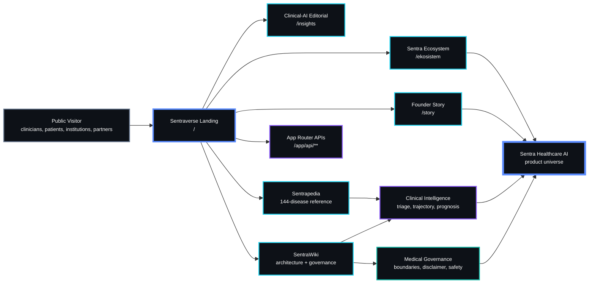
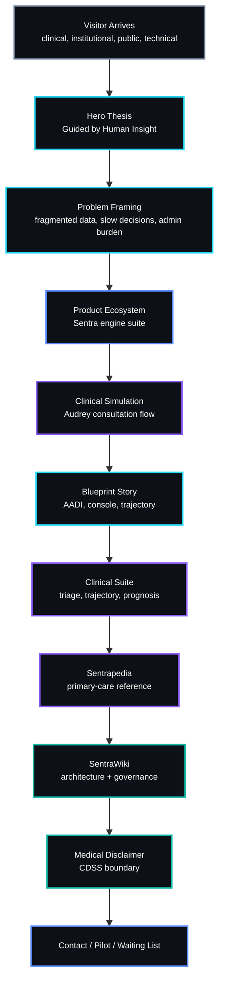
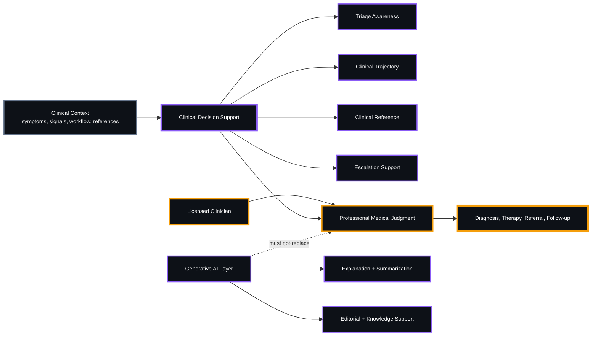
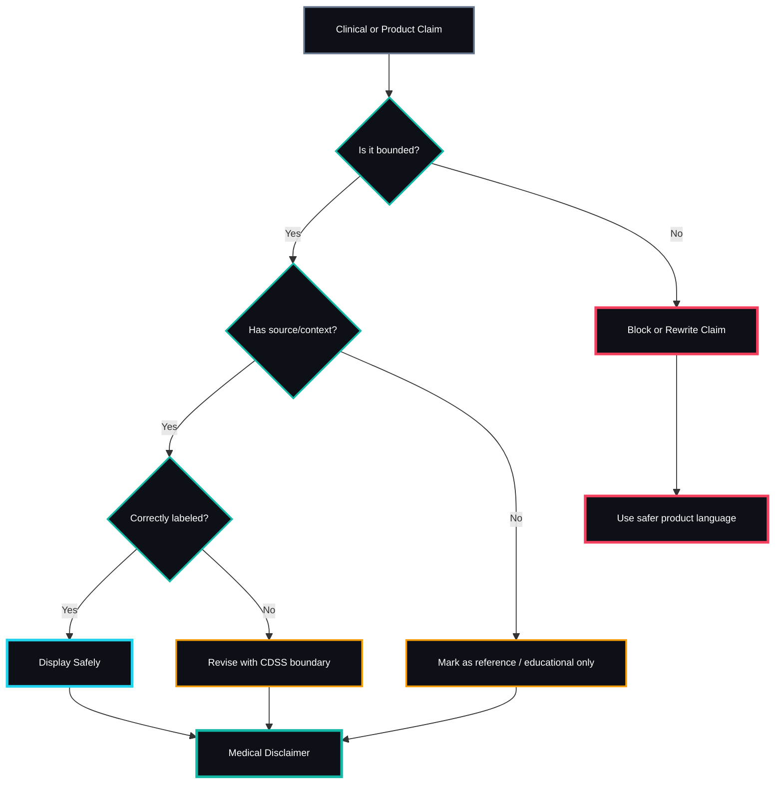
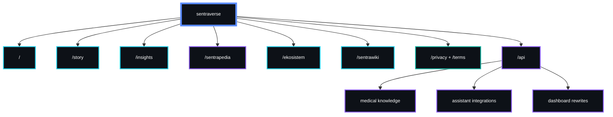
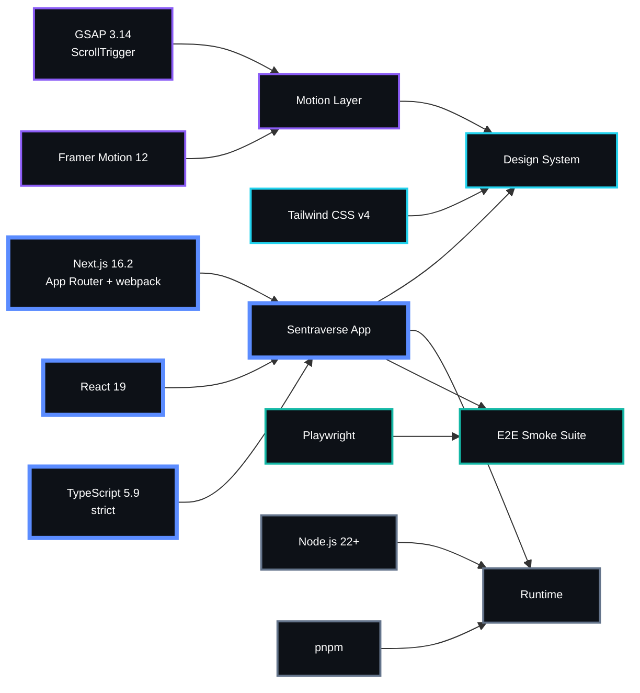
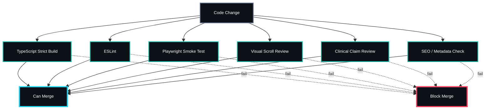

<table width="100%">
<tr>
<td width="34%" align="center" valign="top">


<br />

<b>SENTRAVERSE</b><br />
<sub>Public product + knowledge surface</sub>

<br /><br />


</td>
<td width="66%" valign="top">

SENTRA / CLINICAL INTELLIGENCE FOR INDONESIA

<a href="https://sentrahai.com">
  
</a>

<b>Operational signal:</b> public trust layer · clinical-AI narrative · governed decision support

<a href="https://sentrahai.com"><b>Sentra Healthcare AI</b></a><br />
Sentraverse is the official website, product narrative layer, and public knowledge surface for Sentra Healthcare AI, translating clinical intelligence, founder vision, medical governance, product architecture, and Indonesian primary-care workflow into one coherent digital universe.

<p>
  <a href="https://sentrahai.com"><b>Website</b></a>&nbsp;&nbsp;
  <a href="#system-map"><b>System Map</b></a>&nbsp;&nbsp;
  <a href="#clinical-ai-boundary"><b>Clinical Boundary</b></a>&nbsp;&nbsp;
  <a href="#testing-and-governance"><b>Governance</b></a>&nbsp;&nbsp;
  <a href="#contact"><b>Contact</b></a>
</p>

<sub><code>CLINICAL CONTEXT → CDSS → GOVERNANCE → LICENSED CLINICIAN → DECISION</code></sub>

</td>
</tr>
</table>

---

<a id="executive-summary"></a>

## 01 / EXECUTIVE SUMMARY

**Sentraverse** is the official marketing, product, and knowledge hub for
**Sentra Healthcare AI**.

It is not a generic corporate website. It is the public trust layer for a
clinical-AI ecosystem designed for Indonesian primary care: **Puskesmas**,
**klinik pratama**, referral hospitals, clinicians, healthcare operators,
public-sector stakeholders, and technical partners.

Sentraverse connects six strategic surfaces inside one coherent website:

| <sub><b>Surface</b></sub> | <sub><b>Route</b></sub> | <sub><b>Function</b></sub> |
| --------------------- | -------------- | -------------------------------------------------------- |
| <sub>Clinical-AI Landing</sub> | <sub>`/`</sub> | <sub>Main product narrative and scroll-driven introduction</sub> |
| <sub>Founder Story</sub> | <sub>`/story`</sub> | <sub>Founder journey, product milestones, and roadmap</sub> |
| <sub>Clinical-AI Editorial</sub> | <sub>`/insights`</sub> | <sub>Thought leadership and article index</sub> |
| <sub>Sentrapedia</sub> | <sub>`/sentrapedia`</sub> | <sub>144-disease primary-care clinical reference</sub> |
| <sub>Sentra Ecosystem</sub> | <sub>`/ekosistem`</sub> | <sub>Product ecosystem and application catalog</sub> |
| <sub>SentraWiki</sub> | <sub>`/sentrawiki`</sub> | <sub>Architecture, governance, compliance, and knowledge base</sub> |

The center of gravity is simple:

> Sentraverse explains why Sentra exists, how it supports clinical work, where
> its boundaries are, and why it matters for Indonesia’s frontline healthcare
> system.

---

<a id="product-thesis"></a>

## 02 / PRODUCT THESIS

> A clinical-AI product does not earn trust through animation alone. It earns
> trust by making its purpose, workflow, safety posture, and governance legible.

Sentraverse is built to answer four strategic questions:

| <sub><b>Strategic Question</b></sub> | <sub><b>Sentraverse Answer</b></sub> |
| ----------------------------- | ------------------------------------------------------------------------------------------------- |
| <sub>What is Sentra Healthcare AI?</sub> | <sub>A workflow-native clinical intelligence layer for Indonesian healthcare</sub> |
| <sub>Why does it matter?</sub> | <sub>It reduces fragmented information, slow escalation, and administrative burden</sub> |
| <sub>How does the product think?</sub> | <sub>Through triage intelligence, clinical trajectory, reference knowledge, and governed AI assistance</sub> |
| <sub>How is safety protected?</sub> | <sub>By positioning Sentra as clinical decision support, not a replacement for licensed clinicians</sub> |

---

<a id="sentra-design-language"></a>

## 03 / SENTRA DESIGN LANGUAGE

Sentraverse follows the **Sentra Healthcare AI** design language: clinical,
editorial, architectural, precise, and memorable.

| <sub><b>Element</b></sub> | <sub><b>Direction</b></sub> |
| --------------- | ----------------------------------------------------------------------------- |
| <sub>Visual tone</sub> | <sub>Dark editorial clinical command center</sub> |
| <sub>Background</sub> | <sub>Charcoal, warm ink, cream plates, and intentional high-contrast sections</sub> |
| <sub>Accent</sub> | <sub>Red-orange, Oxford blue, violet, amber, emerald, and sky</sub> |
| <sub>Typography</sub> | <sub>Strong display headings, readable body copy, mono labels for system signals</sub> |
| <sub>Component shape</sub> | <sub>Thin-border cards, clinical panels, tactical badges, product command surfaces</sub> |
| <sub>Motion</sub> | <sub>Used for sequence, explanation, and orientation — never empty decoration</sub> |
| <sub>AI posture</sub> | <sub>Supports clinical reasoning; does not replace professional judgment</sub> |
| <sub>Safety posture</sub> | <sub>Clinical claims must remain bounded, transparent, and governed</sub> |

---

<a id="table-of-contents"></a>

## 04 / README INDEX

<details>
<summary><b><code>OPEN README NAVIGATION</code></b></summary>

- [Executive Summary](#executive-summary)
- [Product Thesis](#product-thesis)
- [Design Language](#sentra-design-language)
- [System Map](#system-map)
- [Experience Loop](#experience-loop)
- [Product Surfaces](#product-surfaces)
- [Homepage Topology](#homepage-topology)
- [Clinical Boundary](#clinical-ai-boundary)
- [Medical Safety](#medical-safety-model)
- [Route Map](#route-map)
- [Architecture](#architecture-folder-map)
- [Technology Stack](#technology-stack)
- [Design Tokens](#design-tokens)
- [Motion System](#motion-system)
- [Build Protocol](#local-runbook)
- [Environment](#environment-variables)
- [Testing & Governance](#testing-and-governance)
- [SEO](#seo-and-discoverability)
- [Documentation](#documentation)
- [Important Files](#most-important-files)
- [Product Truth](#product-truth-principles)
- [Medical Disclaimer](#medical-disclaimer)
- [License](#license)
- [Contact](#contact)
- [Let's Connect](#lets-connect)
- [Active Stack](#active-stack)
- [Instrumentation](#instrumentation)

</details>

---

<a id="system-map"></a>

## 05 / SYSTEM MAP



---

<a id="experience-loop"></a>

## 06 / EXPERIENCE LOOP

Sentraverse is not a static homepage. It is a guided trust-building loop.



---

<a id="product-surfaces"></a>

## 07 / PRODUCT SURFACES

Sentraverse exposes the public product universe through five content surfaces plus its application/API layer.

```mermaid
%%{init: {"flowchart": {"padding": 18}, "themeVariables": {"fontFamily": "monospace", "fontSize": "11px"}}}%%
flowchart TB
    Root["SENTRAVERSE"]

    Landing["LANDING PAGE"]
    Story["STORY"]
    Insights["INSIGHTS"]
    Pedia["SENTRAPEDIA"]
    Ecosystem["EKOSISTEM"]
    Wiki["SENTRAWIKI"]
    API["API"]

    Root --> Landing
    Root --> Story
    Root --> Insights
    Root --> Pedia
    Root --> Ecosystem
    Root --> Wiki
    Root --> API

    Landing --> L1["Hero · Project Slider · About Sentra"]
    Landing --> L2["Ecosystem · SentraSim · Clinical Suite · FAQ"]
    Story --> S1["Founder Journey · Product Timeline · Milestones · Roadmap"]
    Insights --> I1["Clinical AI Editorial · Article Index · Medium · Substack"]
    Pedia --> P1["144 Diseases · Search · Category Filter · Detail Panel"]
    Ecosystem --> E1["Sentra Products · Product Status · Application Catalog · Domain Map"]
    Wiki --> W1["Abyss Architecture · Crown Jewel Engines · Governance · Compliance"]
    API --> A1["Medical Knowledge · Assistant Integrations · Dashboard Rewrite"]

    classDef core fill:#0D1117,stroke:#5B8CFF,color:#FFFFFF,stroke-width:2.5px;
    classDef surface fill:#0D1117,stroke:#22D3EE,color:#FFFFFF,stroke-width:1.8px;
    classDef clinical fill:#0D1117,stroke:#8B5CF6,color:#FFFFFF,stroke-width:1.8px;
    classDef control fill:#0D1117,stroke:#14B8A6,color:#FFFFFF,stroke-width:1.8px;
    classDef shared fill:#0D1117,stroke:#64748B,color:#FFFFFF,stroke-width:1.5px;

    class Root core;
    class Landing,Story,Insights,Ecosystem surface;
    class Pedia,API clinical;
    class Wiki control;
    class L1,L2,S1,I1,P1,E1,W1,A1 shared;
```



---

<a id="homepage-topology"></a>

## 08 / HOMEPAGE TOPOLOGY

The landing page is rendered from `app/page.tsx` as a 15-section scroll-driven
editorial experience.

```mermaid
%%{init: {"flowchart": {"padding": 18}, "themeVariables": {"fontFamily": "monospace", "fontSize": "11px"}}}%%
flowchart TB
    Page["Landing Page<br/>app/page.tsx"]

    Hero["Hero<br/>rotating keyword + Audrey card"]
    Slider["ProjectSlider<br/>clinical footage"]
    AboutSentra["AboutSentra<br/>platform introduction"]
    About["About<br/>manifesto + Asclepius clock"]
    Ecosystem["Ecosystem<br/>pinned product cards"]
    Clients["Clients<br/>technology + institution marks"]
    SentraSim["SentraSim<br/>clinical screen + terminal"]
    Interlude["Interlude<br/>visual breather"]
    Blueprint["BlueprintStory<br/>AADI + console + trajectory"]
    Showcase["Showcase<br/>agents + thinking stack"]
    Services["Services<br/>accordion"]
    ClinicalSuite["ClinicalSuite<br/>triage + trajectory + prognosis"]
    Gallery["ScrollGallery<br/>scroll-driven imagery"]
    FAQ["FAQ<br/>JSON-LD FAQPage"]
    Footer["Footer<br/>brand plate + disclaimer"]

    Page --> Hero
    Page --> Slider
    Page --> AboutSentra
    Page --> About
    Page --> Ecosystem
    Page --> Clients
    Page --> SentraSim
    Page --> Interlude
    Page --> Blueprint
    Page --> Showcase
    Page --> Services
    Page --> ClinicalSuite
    Page --> Gallery
    Page --> FAQ
    Page --> Footer

    classDef page fill:#0D1117,stroke:#5B8CFF,color:#FFFFFF,stroke-width:4px;
    classDef hero fill:#0D1117,stroke:#22D3EE,color:#FFFFFF,stroke-width:3px;
    classDef product fill:#0D1117,stroke:#5B8CFF,color:#FFFFFF,stroke-width:2px;
    classDef clinical fill:#0D1117,stroke:#8B5CF6,color:#FFFFFF,stroke-width:2px;
    classDef content fill:#0D1117,stroke:#22D3EE,color:#FFFFFF,stroke-width:2px;
    classDef governance fill:#0D1117,stroke:#14B8A6,color:#FFFFFF,stroke-width:2px;

    class Page page;
    class Hero,About,Footer hero;
    class Ecosystem,Showcase,Services product;
    class SentraSim,Blueprint,ClinicalSuite clinical;
    class Slider,AboutSentra,Clients,Interlude,Gallery content;
    class FAQ governance;
```



---

<a id="homepage-sections"></a>

## 09 / HOMEPAGE SECTIONS

| <sub>#</sub> | <sub>Section</sub> | <sub>Function</sub> |
| <sub>--:</sub> | <sub>----------------</sub> | <sub>-----------------------------------------------------------------------------------------------------</sub> |
| <sub>1</sub> | <sub>`Hero`</sub> | <sub>Rotating GSAP headline keyword, count-up metrics, 4-phase Audrey consultation card, ambient scan-line</sub> |
| <sub>2</sub> | <sub>`ProjectSlider`</sub> | <sub>Full-bleed clinical footage and product atmosphere</sub> |
| <sub>3</sub> | <sub>`AboutSentra`</sub> | <sub>Platform introduction and positioning</sub> |
| <sub>4</sub> | <sub>`About`</sub> | <sub>Manifesto section with light plate, GSAP draw-in rules, and Asclepius clock mark</sub> |
| <sub>5</sub> | <sub>`Ecosystem`</sub> | <sub>Horizontally pinned product cards with GSAP scrub and typing subtitle</sub> |
| <sub>6</sub> | <sub>`Clients`</sub> | <sub>Technology and institution marks</sub> |
| <sub>7</sub> | <sub>`SentraSim`</sub> | <sub>Embedded clinical screen simulation with live code terminal</sub> |
| <sub>8</sub> | <sub>`Interlude`</sub> | <sub>Static visual breather between pinned sequences</sub> |
| <sub>9</sub> | <sub>`BlueprintStory`</sub> | <sub>Pinned multi-scene blueprint narrative covering AADI, console, and trajectory</sub> |
| <sub>10</sub> | <sub>`Showcase`</sub> | <sub>Orchestration agents and thinking-stack terminal</sub> |
| <sub>11</sub> | <sub>`Services`</sub> | <sub>Service accordion</sub> |
| <sub>12</sub> | <sub>`ClinicalSuite`</sub> | <sub>Tabbed clinical workspace for triage, trajectory, and prognosis</sub> |
| <sub>13</sub> | <sub>`ScrollGallery`</sub> | <sub>Scroll-driven product and clinical imagery</sub> |
| <sub>14</sub> | <sub>`FAQ`</sub> | <sub>12-question FAQ section with two-column cream plate and JSON-LD FAQPage</sub> |
| <sub>15</sub> | <sub>`Footer`</sub> | <sub>Acid-yellow brand plate with contact, waiting list, stewardship, and medical disclaimer</sub> |

---

<a id="clinical-ai-boundary"></a>

## 10 / CLINICAL-AI BOUNDARY

Sentraverse must explain Sentra clearly without overstating clinical capability.



### Boundary Rules

| <sub><b>Layer</b></sub> | <sub><b>Allowed</b></sub> | <sub><b>Not Allowed</b></sub> |
| ------------------- | ----------------------------------------------------------- | ----------------------------------------------------- |
| <sub>Website</sub> | <sub>Explain mission, workflow, product surfaces, and governance</sub> | <sub>Claim autonomous diagnosis or treatment</sub> |
| <sub>Sentrapedia</sub> | <sub>Provide structured clinical reference</sub> | <sub>Replace clinical examination</sub> |
| <sub>Clinical simulation</sub> | <sub>Demonstrate workflow and escalation logic</sub> | <sub>Pretend to be real patient management</sub> |
| <sub>AI explanation</sub> | <sub>Clarify, summarize, and support comprehension</sub> | <sub>Override licensed clinician judgment</sub> |
| <sub>Product claim</sub> | <sub>State CDSS support role</sub> | <sub>State medical-device equivalence without registration</sub> |

---

<a id="medical-safety-model"></a>

## 11 / MEDICAL SAFETY MODEL



---

<a id="route-map"></a>

## 12 / ROUTE MAP

| <sub><b>Route</b></sub> | <sub><b>Rendering</b></sub> | <sub><b>Purpose</b></sub> |
| -------------- | ----------- | ---------------------------------------------------------------------- |
| <sub>`/`</sub> | <sub>Static</sub> | <sub>Landing page with 15-section scroll-driven product experience</sub> |
| <sub>`/story`</sub> | <sub>Static</sub> | <sub>Founder story, product milestones, timeline, and roadmap</sub> |
| <sub>`/insights`</sub> | <sub>Static</sub> | <sub>Clinical-AI editorial index</sub> |
| <sub>`/sentrapedia`</sub> | <sub>Static</sub> | <sub>144-disease clinical reference for primary care</sub> |
| <sub>`/ekosistem`</sub> | <sub>Static</sub> | <sub>Sentra product ecosystem and application catalog</sub> |
| <sub>`/sentrawiki`</sub> | <sub>Static</sub> | <sub>Knowledge base, architecture, governance, and compliance</sub> |
| <sub>`/privacy`</sub> | <sub>Static</sub> | <sub>Privacy policy</sub> |
| <sub>`/terms`</sub> | <sub>Static</sub> | <sub>Terms of use</sub> |
| <sub>`/api/*`</sub> | <sub>Edge / Node</sub> | <sub>Supporting API routes for medical knowledge and assistant integrations</sub> |



---

<a id="architecture-folder-map"></a>

## 13 / ARCHITECTURE FOLDER MAP

```text
sentraverse/
├── app/
│   ├── page.tsx               # Landing page — 15 sections
│   ├── layout.tsx             # Root layout, fonts, JSON-LD, SmoothScrollProvider
│   ├── globals.css            # Design tokens, scoped themes, keyframes
│   ├── story/                 # Founder and product story
│   ├── insights/              # Editorial index and article data
│   ├── sentrapedia/           # 144-disease clinical reference
│   ├── ekosistem/             # Product ecosystem catalog
│   ├── sentrawiki/            # Knowledge base with paper theme
│   ├── privacy/               # Privacy policy
│   ├── terms/                 # Terms of use
│   ├── api/                   # Supporting API routes
│   ├── sitemap.ts             # Dynamic sitemap
│   ├── robots.ts              # Robots convention
│   └── opengraph-image.tsx    # Generated OpenGraph image
│
├── components/
│   ├── *.tsx                  # Section components
│   ├── blueprint-story/       # Pinned blueprint scenes
│   ├── sentrasim/             # Simulation columns, code terminal, sequence
│   ├── sentrapedia/           # Disease dataset and helpers
│   ├── sentrawiki/            # Engine cards, engine graph, document library
│   ├── ekosistem/             # Product and application data
│   └── ui/                    # UI primitives
│
├── lib/
│   ├── design-governance.ts   # Layout and typography governance
│   ├── use-smooth-scroll.ts   # Custom lerp wheel-smoothing hook
│   ├── site-links.ts          # Internal link single source of truth
│   └── utils.ts               # cn() helper
│
├── docs/                      # Project documentation
├── e2e/                       # Playwright smoke tests
└── public/                    # Static assets
```

---

<a id="technology-stack"></a>

## 14 / TECHNOLOGY STACK

| <sub><b>Layer</b></sub> | <sub><b>Technology</b></sub> |
| --------------- | ------------------------------------------ |
| <sub>Framework</sub> | <sub>Next.js 16.2, App Router, webpack</sub> |
| <sub>Runtime UI</sub> | <sub>React 19</sub> |
| <sub>Language</sub> | <sub>TypeScript 5.9, strict mode</sub> |
| <sub>Styling</sub> | <sub>Tailwind CSS v4 with `@theme`</sub> |
| <sub>Animation</sub> | <sub>GSAP 3.14, ScrollTrigger, Framer Motion 12</sub> |
| <sub>Testing</sub> | <sub>Playwright E2E smoke</sub> |
| <sub>Runtime</sub> | <sub>Node.js 22+</sub> |
| <sub>Package manager</sub> | <sub>pnpm</sub> |



---

<a id="design-tokens"></a>

## 15 / DESIGN TOKENS

Core design tokens are governed through:

- `app/globals.css`
- Tailwind CSS `@theme`
- `lib/design-governance.ts`

| <sub><b>Token</b></sub> | <sub><b>Value</b></sub> | <sub><b>Role</b></sub> |
| ------------------ | ------------------- | --------------------------------------- |
| <sub>`--sentra-bg`</sub> | <sub>`#1e1e1e`</sub> | <sub>Permanent dark site background</sub> |
| <sub>`--sentra-fg`</sub> | <sub>`#b7ab98`</sub> | <sub>Primary foreground ink</sub> |
| <sub>`--sentra-accent`</sub> | <sub>`#eb5939`</sub> | <sub>Sentra red-orange accent</sub> |
| <sub>`--sentra-primary`</sub> | <sub>`#4a7bb5`</sub> | <sub>Oxford blue lifted for dark readability</sub> |
| <sub>Paper scope</sub> | <sub>`#f2ebe0 / #002147`</sub> | <sub>SentraWiki cream plate and navy ink</sub> |
| <sub>Footer plate</sub> | <sub>`#e9fb5b / #111111`</sub> | <sub>Acid-yellow brand anomaly</sub> |

---

<a id="motion-system"></a>

## 16 / MOTION SYSTEM

Sentraverse uses motion as a product explanation layer.

| <sub><b>Motion Pattern</b></sub> | <sub><b>Purpose</b></sub> |
| ---------------------------- | ------------------------------------------------------ |
| <sub>GSAP pinned sections</sub> | <sub>Explain long-form product narrative</sub> |
| <sub>ScrollTrigger scrub</sub> | <sub>Tie animation to user intent</sub> |
| <sub>Rotating hero keyword</sub> | <sub>Communicate product scope quickly</sub> |
| <sub>Count-up metrics</sub> | <sub>Create executive-level energy</sub> |
| <sub>Clinical simulation sequence</sub> | <sub>Show workflow without claiming real patient management</sub> |
| <sub>Framer Motion entrances</sub> | <sub>Improve orientation and section rhythm</sub> |
| <sub>Reduced-motion support</sub> | <sub>Respect accessibility preferences</sub> |

Implementation discipline:

- use `anticipatePin` for stable pinned transitions
- use `invalidateOnRefresh` for responsive recalculation
- avoid motion that hides information
- avoid autoplay clinical claims
- keep animation subordinate to product meaning

---

<a id="local-runbook"></a>

## 17 / BUILD PROTOCOL

### Prerequisites

| <sub><b>Requirement</b></sub> | <sub><b>Version</b></sub> |
| ----------- | ------- |
| <sub>Node.js</sub> | <sub>`>= 22`</sub> |
| <sub>pnpm</sub> | <sub>`>= 9`</sub> |

### Install

```bash
pnpm install
```

### Development

```bash
pnpm dev
```

Local server:

```text
http://localhost:3000
```

### Production

```bash
pnpm build
pnpm start
```

### Validation

```bash
pnpm lint
pnpm build
pnpm test:e2e
```

Execution notes:

- Use `pnpm`, not npm/yarn/bun.
- The site runs with zero required environment configuration.
- Production-facing changes should pass build, lint, and Playwright smoke
  validation.
- Scroll-driven sections require visual sanity checks after layout or animation
  changes.

---

<a id="environment-variables"></a>

## 18 / ENVIRONMENT VARIABLES

All environment variables are optional.

| <sub><b>Variable</b></sub> | <sub><b>Scope</b></sub> | <sub><b>Purpose</b></sub> |
| ----------------------------- | ------ | ------------------------------------------------------------------------------------------------------------------------------------- |
| <sub>`NEXT_PUBLIC_PILOT_LOGIN_URL`</sub> | <sub>Client</sub> | <sub>Target URL for the “Tes Pilot Login” CTA. Validated against an allow-list of `sentrahai.com` hosts and falls back to `/dashboard`.</sub> |
| <sub>`SENTRA_DASHBOARD_URL`</sub> | <sub>Server</sub> | <sub>When set, `next.config.mjs` rewrites `/dashboard/:path*` to that origin, allowing the marketing host to front the clinical dashboard.</sub> |

---

<a id="testing-and-governance"></a>

## 19 / TESTING & GOVERNANCE



### Required Validation

| <sub><b>Area</b></sub> | <sub><b>Minimum Check</b></sub> |
| ------------------ | ------------------------------------------------------------------- |
| <sub>Type safety</sub> | <sub>TypeScript strict build must pass</sub> |
| <sub>Lint</sub> | <sub>ESLint must pass</sub> |
| <sub>E2E</sub> | <sub>Playwright smoke suite must pass</sub> |
| <sub>Scroll experience</sub> | <sub>GSAP pinned sections must remain stable</sub> |
| <sub>Accessibility</sub> | <sub>Motion should respect reduced-motion preferences</sub> |
| <sub>Clinical language</sub> | <sub>Claims must remain within CDSS boundary</sub> |
| <sub>Medical disclaimer</sub> | <sub>Disclaimer must remain visible and accurate</sub> |
| <sub>SEO</sub> | <sub>Sitemap, robots, metadata, OpenGraph, and JSON-LD must remain valid</sub> |

---

<a id="seo-and-discoverability"></a>

## 20 / SEO & DISCOVERABILITY

Sentraverse includes structured SEO and AI-discoverability support.

| <sub><b>Asset</b></sub> | <sub><b>Purpose</b></sub> |
| -------------------------- | -------------------------------------------- |
| <sub>`app/sitemap.ts`</sub> | <sub>Dynamic sitemap</sub> |
| <sub>`app/robots.ts`</sub> | <sub>Robots convention and `/dashboard` exclusion</sub> |
| <sub>`app/opengraph-image.tsx`</sub> | <sub>Generated OpenGraph image</sub> |
| <sub>JSON-LD Organization</sub> | <sub>Identifies Sentra Healthcare AI</sub> |
| <sub>JSON-LD Person</sub> | <sub>Identifies founder profile</sub> |
| <sub>JSON-LD FAQPage</sub> | <sub>Supports FAQ discoverability</sub> |
| <sub>`public/llms.txt`</sub> | <sub>Context surface for AI crawlers</sub> |
| <sub>Google Search Console file</sub> | <sub>Search verification</sub> |

---

<a id="documentation"></a>

## 21 / DOCUMENTATION

| <sub><b>Document</b></sub> | <sub><b>Content</b></sub> |
| --------------------------- | ---------------------------------------------- |
| <sub>`docs/README.md`</sub> | <sub>Documentation index</sub> |
| <sub>`ARCHITECTURE.md`</sub> | <sub>Architecture deep-dive</sub> |
| <sub>`docs/design-governance.md`</sub> | <sub>Spacing, typography, density, and layout rules</sub> |
| <sub>`docs/ai-governance.md`</sub> | <sub>Clinical-AI governance principles</sub> |
| <sub>`CHANGELOG.md`</sub> | <sub>Release history</sub> |
| <sub>`CONTRIBUTING.md`</sub> | <sub>Contribution workflow</sub> |
| <sub>`SECURITY.md`</sub> | <sub>Security policy</sub> |

---

<a id="most-important-files"></a>

## 22 / MOST IMPORTANT FILES

| <sub><b>File</b></sub> | <sub><b>Why It Matters</b></sub> |
| ------------------------------ | ----------------------------------------------------- |
| <sub>`app/page.tsx`</sub> | <sub>Main landing page and 15-section composition</sub> |
| <sub>`app/layout.tsx`</sub> | <sub>Root layout, fonts, JSON-LD, and SmoothScrollProvider</sub> |
| <sub>`app/globals.css`</sub> | <sub>Design tokens, scoped themes, keyframes</sub> |
| <sub>`lib/design-governance.ts`</sub> | <sub>Layout and typography governance</sub> |
| <sub>`lib/use-smooth-scroll.ts`</sub> | <sub>Custom lerp wheel-smoothing hook</sub> |
| <sub>`lib/site-links.ts`</sub> | <sub>Internal link single source of truth</sub> |
| <sub>`components/Hero.tsx`</sub> | <sub>Main product thesis and first impression</sub> |
| <sub>`components/Ecosystem.tsx`</sub> | <sub>Horizontally pinned product ecosystem</sub> |
| <sub>`components/SentraSim.tsx`</sub> | <sub>Embedded clinical screen simulation</sub> |
| <sub>`components/ClinicalSuite.tsx`</sub> | <sub>Triage, trajectory, and prognosis workspace</sub> |
| <sub>`components/blueprint-story/*`</sub> | <sub>Pinned blueprint scenes</sub> |
| <sub>`components/sentrapedia/*`</sub> | <sub>144-disease clinical reference</sub> |
| <sub>`components/sentrawiki/*`</sub> | <sub>Knowledge base, engine cards, and document library</sub> |
| <sub>`components/ekosistem/*`</sub> | <sub>Product and application catalog</sub> |

---

<a id="product-truth-principles"></a>

## 23 / PRODUCT TRUTH PRINCIPLES

Sentraverse is intentionally governed by these rules:

1. **Clinical-AI must be explained without exaggeration.**
2. **Sentra is clinical decision support, not a doctor replacement.**
3. **The website must communicate workflow, not just aesthetics.**
4. **Every clinical claim must remain bounded and responsible.**
5. **Motion must clarify the product story, not distract from it.**
6. **Sentrapedia is reference support, not diagnosis automation.**
7. **SentraWiki is the architecture and governance anchor.**
8. **The ecosystem must feel integrated, not like disconnected products.**
9. **Trust is built through clarity, boundaries, and disciplined language.**
10. **The public surface must protect the seriousness of the clinical mission.**

---

<a id="medical-disclaimer"></a>

## 24 / MEDICAL DISCLAIMER

Sentra AI functions as a **clinical decision support system**.

It is designed to support clinical reasoning, triage awareness, workflow
acceleration, and timely escalation. It does **not** replace professional
medical judgment, licensed clinical responsibility, clinical examination,
diagnosis, therapy, referral decisions, or formal follow-up planning by
healthcare professionals.

Sentra AI is not registered as a medical device.

All diagnostic, therapeutic, referral, and follow-up decisions remain the full
responsibility of licensed medical professionals.

---

<a id="license"></a>

## 25 / LICENSE

ISC © 2026 **Sentra Healthcare Solutions**

---

<a id="contact"></a>

## 26 / CONTACT

**dr. Ferdi Iskandar** — Founder & CEO, Sentra Healthcare AI

<p>
  <a href="mailto:drferdiiskandar@sentrahai.com"></a>
  <a href="https://sentrahai.com"></a>
</p>

<sub><b>Lab:</b> Melinda Advanced Technology Laboratory · <b>Location:</b> Kediri, East Java</sub>

---

<a id="lets-connect"></a>

## 27 / LET'S CONNECT

<p align="center">
  <a href="https://ferdiiskandar.com" title="MyWebsite"></a>&nbsp;&nbsp;
  <a href="https://medium.com/@drferdiiskandar" title="Medium"></a>&nbsp;&nbsp;
  <a href="https://orcid.org/my-orcid?orcid=0009-0003-3788-1307" title="ORCID"></a>&nbsp;&nbsp;
  <a href="https://x.com/drferdiiskandar" title="X"></a>&nbsp;&nbsp;
  <a href="https://substack.com/@drferdiiskandar" title="Substack"></a>&nbsp;&nbsp;
  <a href="https://kaggle.com/drferdiiskandar" title="Kaggle"></a>&nbsp;&nbsp;
  <a href="https://reddit.com/user/SixCupaCoffee" title="Reddit"></a>&nbsp;&nbsp;
  <a href="https://linkedin.com/in/dr-ferdi-iskandar-1b620a3b5" title="LinkedIn"></a>&nbsp;&nbsp;
  <a href="https://huggingface.co/dr-Ferdi" title="Hugging Face"></a>&nbsp;&nbsp;
  <a href="https://www.tiktok.com/@ferdiiskandar.md" title="TikTok"></a>&nbsp;&nbsp;
  <a href="https://www.instagram.com/drferdiiskandar" title="Instagram"></a>&nbsp;&nbsp;
  <a href="https://www.threads.com/@drferdiiskandar" title="Threads"></a>
</p>

---

<a id="active-stack"></a>

## 28 / ACTIVE STACK

<sub><code>PROJECT-DECLARED TECHNOLOGY SURFACE · PRESERVED FROM SOURCE README</code></sub>

<table width="100%">
<tr>
<td width="50%" valign="top">
<b><code>NEXT.JS 16.2</code></b><br />
<small>App Router application framework with webpack.</small>
</td>
<td width="50%" valign="top">
<b><code>REACT 19</code></b><br />
<small>Runtime UI layer for the Sentraverse application.</small>
</td>
</tr>
<tr>
<td width="50%" valign="top">
<b><code>TYPESCRIPT 5.9</code></b><br />
<small>Strict-mode application language.</small>
</td>
<td width="50%" valign="top">
<b><code>TAILWIND CSS v4</code></b><br />
<small>Theme-driven styling surface using <code>@theme</code>.</small>
</td>
</tr>
<tr>
<td width="50%" valign="top">
<b><code>GSAP 3.14 + SCROLLTRIGGER</code></b><br />
<small>Scroll-bound narrative and pinned motion sequences.</small>
</td>
<td width="50%" valign="top">
<b><code>FRAMER MOTION 12</code></b><br />
<small>Entrance motion and interface orientation.</small>
</td>
</tr>
<tr>
<td width="50%" valign="top">
<b><code>PLAYWRIGHT</code></b><br />
<small>E2E smoke validation.</small>
</td>
<td width="50%" valign="top">
<b><code>NODE.JS 22+ · PNPM</code></b><br />
<small>Runtime and package-management baseline.</small>
</td>
</tr>
</table>

---

<a id="instrumentation"></a>

## 29 / INSTRUMENTATION

<small><code>DECLARED TECHNOLOGY SURFACE · COMPACT / CATEGORY-BASED</code></small>

<table width="100%">
<tr>
<td width="50%" valign="top">
<b><code>01 · LANGUAGES & RUNTIMES</code></b><br />
<small>TypeScript 5.9 · Node.js 22+ · PowerShell</small>
</td>
<td width="50%" valign="top">
<b><code>02 · FRONTEND & UI ENGINE</code></b><br />
<small>Next.js 16.2 · React 19 · Tailwind CSS v4 · webpack</small>
</td>
</tr>
<tr>
<td width="50%" valign="top">
<b><code>03 · MOTION & INTERACTION</code></b><br />
<small>GSAP 3.14 · ScrollTrigger · Framer Motion 12</small>
</td>
<td width="50%" valign="top">
<b><code>04 · TESTING & QA</code></b><br />
<small>Playwright E2E smoke · ESLint · TypeScript strict build · visual scroll review</small>
</td>
</tr>
<tr>
<td width="50%" valign="top">
<b><code>05 · PACKAGE & BUILD</code></b><br />
<small>pnpm · Next.js build pipeline · webpack</small>
</td>
<td width="50%" valign="top">
<b><code>06 · HOSTING / DELIVERY</code></b><br />
<small>Vercel is listed in the source instrumentation; static and Edge/Node route modes are declared elsewhere in this README.</small>
</td>
</tr>
</table>

---

<p align="center">
  <b>Dedicated to Aldebaran, Aimee, Audrey, and Del — &amp; the Indonesia Healthcare Ecosystem.</b><br />
  Sentra Artificial Intelligence · Indonesia<br />
  <sub><code>// GUIDED BY HUMAN INSIGHT · CLINICAL AUTHORITY REMAINS HUMAN</code></sub>
</p>
